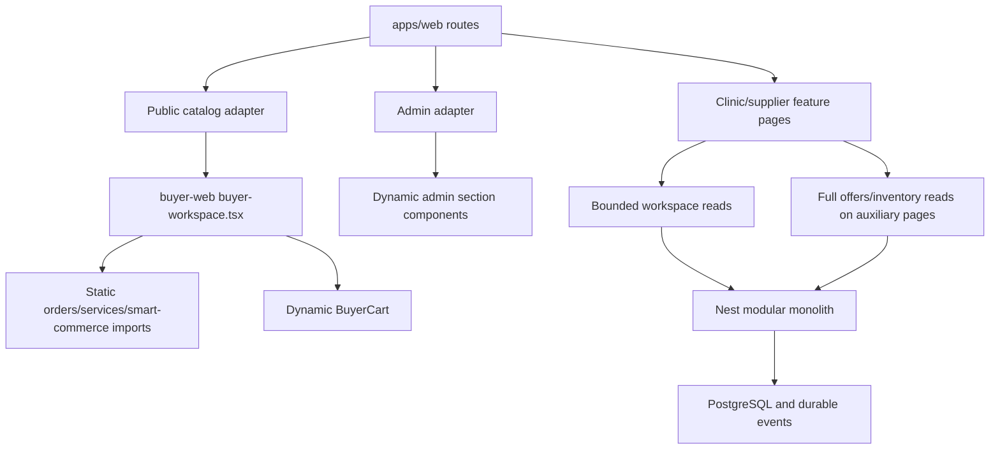

# Аудит архитектуры и frontend PlatformaMarket

Дополнение01.10.2026: владелец разрешил единый выпуск перечисленных предложений.
Реализация и evidence ведутся в [PERFORMANCE-CI-DELIVERY](../governance/task-state/PERFORMANCE-CI-DELIVERY-2026-09-30.md).
A-01/F-01/F-02: новые CI/budget, отдельный PublicCatalog, ограниченные auxiliary
reads уже реализованы. F-03/F-04: выбранный SupplierOperations разделён внутри
lazy section, устранён измеренный двойной GET, добавлена отмена GET. F-05:
dynamic root сохранён ради per-request CSP nonce. A-02/A-03: выделена операция
createActiveCart с прежней транзакцией и узкие package exports по bundle trace.
Выпуск8045225/75e0e21 опубликован; полный CI/Security и api/web containers PASS.
Исходный статический срез ниже сохраняет
основания предложений; он не является новой очередью повторной реализации.

Срез: main@2a816c337bae15f6684318cf26d21bf6f71cb3c5, 30.09.2026.
Scope: статическая сверка кода, контрактов, routes, build/CI и существующего
evidence. Код, зависимости, БД, dev и CI не изменялись. Это предложения для
отдельных задач; новый runtime/нагрузочный/security audit не выполнялся.

## Вывод

Сохранять modular monolith и единый Next.js frontend. Основной выигрыш ожидается
от уменьшения реально загружаемого клиентского графа публичного каталога и
ограничения оставшихся полных supplier read endpoints. Разделение крупных
сервисов полезно для управляемости изменений, но само по себе не ускоряет API.
Перед этим нужен отдельный scope на воспроизводимый CI и канонический web budget.

Уже выполненные A01–A18, cursor pagination основных workspace lists, lazy cart
и lazy admin sections не предлагаются повторно. Полный CORE/production не принят.
Статусы и остаток — [Matrix](../governance/PROJECT_ACCEPTANCE_MATRIX.md) и
[Foundation](../backend/DENTMARKET_BACKEND_FOUNDATION_V2.md).

## Фактический путь страницы

Route adapters в apps/web короткие, однако это не означает маленький browser
bundle. Значима достижимость импортов. Старый supplier/page.tsx не обслуживает
основные новые supplier routes, поэтому его длина не главный приоритет.

## Наблюдения и предложения

### P1 — A-01: привести CI и release к реальному runtime

**Подтверждено кодом и последним CI.** [package.json](../../package.json)
собирает apps/web, исключая четыре legacy frontend.
[release.yml](../../.github/workflows/release.yml) всё ещё перечисляет
api/admin/buyer/supplier/landing. Docker target web есть, но он не доказывает
выпуск этого приложения. Legacy verify:web и FlowA/B2/B3 — другие browser configs.

[with-test-database](../../scripts/with-test-database.mjs) использует
[local-database-profile](../../scripts/lib/local-database-profile.mjs),
выбирающий TEST_DATABASE_URL/default audit. CI передаёт прежний
POSTGRES_TEST_DATABASE_URL/готовит marketplace, а fixture guard в CI ожидает
marketplace. Последний run остановился на этом несовпадении. Это блокер
проверяемой доставки, не доказательство отказа рабочего checkout.

**Предложение:** отдельно согласовать единый test DB contract и canonical web
job/budget; сохранить guard и disposable DB. Release/ingress менять только в
отдельном deployment scope. Dependency audit исправлять отдельным минимальным
change set. DoD: точный SHA, зелёные обязательные jobs, canonical build artifact
и browser config; legacy rollback evidence явно отдельно. Не снижать budgets
и не объявлять отсутствующий job PASS.

### P1 — F-01: выделить публичный каталог из buyer-workspace

**Подтверждено статически.** [Public route](../../apps/web/app/%28marketplace%29/page.tsx)
импортирует [buyer-workspace](../../apps/buyer-web/app/buyer-workspace.tsx):
1486 строк,58 588 байт исходного текста,37 вызовов useState и6 useEffect.
Это текстовые метрики, не размер JS после сборки и не измерение задержки.
В том же client module находятся фильтры/URL, сравнение, cart/orders/documents,
notifications, reviews и routing по active. BuyerOrders, BuyerServicesPanel,
SmartCommercePanel импортированы статически. Public mode выбирает каталог,
но все эти ветви остаются частью общего исходного графа.

**Предложение:** отдельный PublicCatalog feature entry; вынести URL/filter
state и search orchestration в тематические hooks/pure utilities; dialog/
comparison/reviews загружать по реальному открытию, если bundle trace подтвердит
их присутствие в initial chunk. BuyerCart уже dynamic — не повторять этот fix.
Не переносить все37 states механически в один новый hook и не делить файл только
по числу строк. Сохранить общую карточку/price semantics и адаптер для legacy.

**Ожидаемый эффект:** меньший initial JS/hydration и меньшая зона rerender;
величина пока не измерена. Проверка: cold/warm /catalog, initial gzip/chunks,
parse/evaluate/long tasks, search/filter/scroll/return на390/1440, память и
число запросов. Критические инварианты: URL count/filters, city validation,
latest-request-wins, guest→login→return, tenant switch, focus и cart revalidation.
Сначала baseline; принять только измеренное улучшение без регрессий, не обещать %.

### P1 — F-02: ограничить offers и inventory на вспомогательных страницах

**Подтверждено с обеих сторон.** [supplier-product-pages](../../apps/web/app/workspaces/supplier-product-pages.tsx)
загружает полный /suppliers/:id/offers для corrections и полный inventory/balances.
[OffersService.list](../../apps/api/src/modules/offers/offers.service.ts) не имеет
верхнего take на offers и включает prices/inventory; priceHistory отдельно
ограничена10. [InventoryService.list](../../apps/api/src/modules/inventory/inventory.service.ts)
возвращает все balances с product/warehouse/lots/active reservations без take.
UI отображает вложенные arrays целиком. Это риск роста payload/DOM, без нового
измерения p95. Overrides уже ограничены200 в
[DataFreshnessService](../../apps/api/src/modules/inventory/data-freshness.service.ts).

**Предложение:** bounded summary DTO для balances/corrections, cursor/filter
на сервере, lots/reservations по раскрытию строки с отдельным ограничением.
Начать с Zod/OpenAPI/client, затем server/select и UI. Сохранить tenant guard,
полный доступ к страницам и честные counts; не обрезать массив на клиенте.
Новый контракт не должен ломать legacy callers. Виртуализацию вводить только
если после ограничения данных остаётся измеримый DOM cost.

Проверка на disposable1000/10000 balances с множеством lots/reservations:
payload, SQL/query count/plan, p95, memory, DOM nodes/render и доступность всех
записей/курсорных переходов. Не заимствовать успешные p95 A12: они относятся к
другим [WorkspaceReadsService](../../apps/api/src/modules/commerce/workspace-reads.service.ts)
endpoints, уже использующим query.limit+1 и узкий select.

### P2 — F-03: дальнейшее разбиение admin внутри ленивых разделов

[integration-operations](../../apps/admin-web/app/integration-operations.tsx):
968 строк/14 useState; [supplier-operations](../../apps/admin-web/app/supplier-operations.tsx):
853/11; [supplier-controls](../../apps/admin-web/app/supplier-controls.tsx):582/13.
Canonical admin использует эти компоненты. Однако
[admin-section-components](../../apps/admin-web/app/admin-section-components.tsx)
уже делает dynamic import разделов: тяжёлый исходник не означает initial load
всего admin. Предложение — разграничить list/detail/editor/mapping/job history
внутри выбранного раздела, вынести формы и state machines, а второстепенные
editors грузить по открытию только после измерения route chunk.

Приоритет — ошибки состояния/поддержка, затем скорость выбранного раздела.
DoD: opening latency/chunks, сохранность draft при refetch/403/409, keyboard
и действительный operator access. Не менять расположение навигации в этом refactor.

### P2 — F-04: измерить повторные reads и отмену запросов

[use-resource](../../apps/web/app/workspaces/use-resource.ts) уже объединяет
одновременные чтения одного loader, отбрасывает поздние результаты, сохраняет
успешные данные и обновляет их по focus/online/visible polling. У API loader
нет AbortSignal, поэтому уход со страницы не отменяет транспортный запрос.
[WorkspacePermissions](../../apps/web/app/workspaces/workspace-permissions.tsx)
использует отдельный ресурс; каждый hook имеет свои event listeners.
Это кандидат на лишнюю работу, не доказанный request storm.

Измерить network waterfall при focus/online/route change, затем при необходимости
передать AbortSignal для GET и объединить только одинаковые чтения с ключом
session+organization+role+query. Не кэшировать разрешения без корректного revoke
и не объединять разные tenants. Writes автоматически не повторять. Отдельно
проверить потерю ответа после commit и сохранность idempotency/action errors.

[workspace.tsx](../../apps/web/app/workspaces/workspace.tsx) создаёт новый context
value при render shell. Сначала React Profiler на открытии mobile menu; memo
или разделение context применять только при подтверждённом лишнем rerender.
Key по role/org/session уже защищает смену identity, его сохранять.

### P2 — F-05: оценить общий динамический root layout

[Корневой layout](../../apps/web/app/layout.tsx) вызывает await connection()
до всех страниц, включая публичные информационные. Это делает request-time
rendering общей политикой. Возможный кандидат — вынести динамическую границу
к auth/catalog-dependent layouts и отдельно принять cache policy публичных
about/suppliers/legal страниц. Не включать общий cache для tenant/session,
цен/остатков или legal version без ревизии инвариантов.
Проверить TTFB/cache headers/build route modes до и после; ускорение не измерено.

### P2 — A-02: дробить backend по use case, сохраняя транзакции

| Сервис | Строки / байты текста | Возможная граница выделения |
| --- | --- | --- |
| commerce.service.ts | 1380 /52 683 | Cart commands, checkout orchestration, confirmation; read model уже выделен |
| imports.service.ts | 1378 /57 019 | Parse/staging, matching orchestration, publication, rollback |
| integration-execution.service.ts | 1228 /41 214 | Claim/lease lifecycle, dispatch adapters, projection/reconciliation |
| search.service.ts | 1058 /43 623 | Query/filter parsing, query plan, offer projection/ranking |
| documents.service.ts | 944 /62 356 | Upload/validation/storage, access/read model, document relations/version |
| payment-settlement.service.ts | 430 /58 205 | Сначала сделать compressed transitions читаемыми внутри выбранного use case |

Метрики получены по668 tracked non-test TS/TSX/MJS/CJS files, не по generated
artifacts. LOC чувствителен к форматированию: payment settlement на430 строк
сопоставим по байтам с commerce. Массовый reformat/реорганизация не предлагается.

Выносить один use case при следующем релевантном изменении. Сохранить Prisma
transaction client, порядок locks, expectedVersion/idempotency, tenant checks,
audit/outbox и компенсацию. Domain service boundaries не равны microservices.
DoD: API/schema compatibility, targeted PG races/rollback/tenant и unchanged
business results; latency/query counts измерить, если обещается ускорение.

### P2 — A-03: уменьшать зависимость shared packages от широких entry points

schemas/index, core-api, api-client/index, ui/index и document-archive собирают
большие повторно используемые поверхности. Есть уже состоявшийся fix cart
chunk, чтобы не тянуть CommonJS schema graph при открытии каталога. Сначала
bundle trace canonical web, затем точечные type-only imports, feature entry
points и exports, сохраняя совместимость. Нельзя считать любой barrel плохим
или добавлять новую библиотеку для request state без доказанной необходимости.

## Порядок отдельных задач и принятие эффекта

1. Исправить CI DB contract и согласовать canonical build/browser/budget.
   Это даст сопоставимые artifacts для остальных работ.
2. Измерить и выделить публичный каталог F-01; сравнить один dataset/profile/
   browser/device/cache mode. Сохранить сырые результаты и минимум несколько
   сопоставимых выборок внутри согласованного бюджета одного gate.
3. Ограничить оставшиеся reads F-02 с контрактом и проверкой полноты данных.
4. По профилю выбрать admin/request/layout/shared package оптимизацию.
5. Backend decomposition делать в затронутом use case, без большого rewrite.

Обязательные проверки будущего TS change: typecheck, unit, diff; contract/PG/
runtime/browser по риску Workflow. Production либо внешний provider не нужны
для измерения локального frontend. Ни одна гипотеза об ускорении здесь не
выдаётся за runtime defect или выполненный fix. Нет нового обещанного процента
ускорения, performance score или общей security certification.

## Выполненная документационная работа

Текущий архитектурный маршрут, реестр остатка, Matrix, role/application docs
и runbooks приведены к unified code. Завершённые и заменённые task cards/
аудиты вынесены из активного дерева, история preserved; gallery references
перенесены в архив вместе с240 связанными assets/страницами. [Полный реестр](../DOCUMENTATION_INDEX.md) содержит классификацию
каждого исходного текстового документа и карту переноса.

Применены прочитанные development-toolkit review/performance/verification,
Agency Backend Architect, Frontend Developer, Code Reviewer и Git Workflow
Master: границы модулей, import reachability, проверяемые гипотезы, scope и
сохранность истории. Делегирование не использовалось.

Документационные gates: verify-docs.cjs PASS (попытка2),397 действующих и481
архивная ссылка,115 документов/305 архивных записей,1508 protected hashes;
8 section anchors и git diff --check PASS. Runtime suites NOT_RUN: код не менялся.
Commit/push NOT_RUN из-за известного CI FAIL по AGENTS §8. Ветка main, исходный
и remote SHA2a816c337bae15f6684318cf26d21bf6f71cb3c5 совпадают. Доставка не принята.
