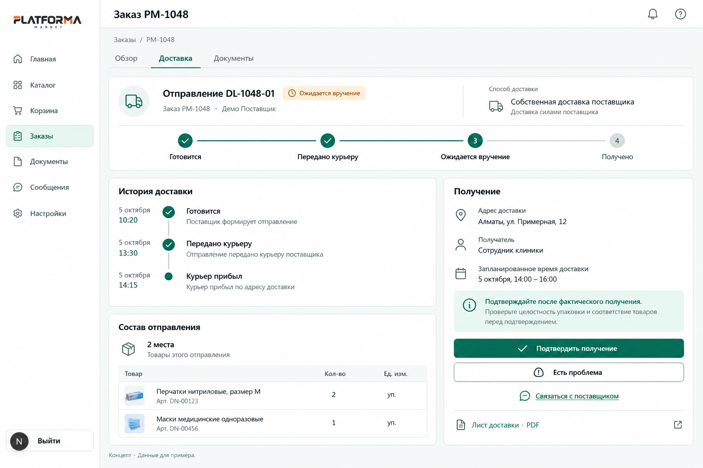
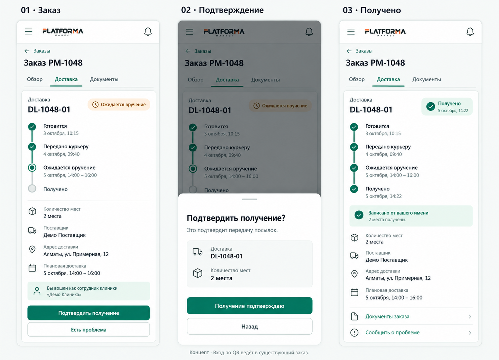
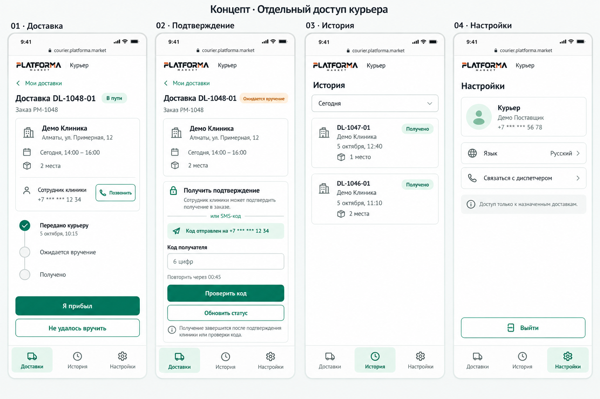

# Delivery Logics and Interface

Технический проект собственной доставки поставщика для Platforma Market. Версия 0.1 от 05.10.2026, для обсуждения и визуального согласования. Документ описывает предлагаемое поведение, интерфейсы, границы доступа и внешние сервисы. Он не свидетельствует о реализации, подключении SMS или приёмке безопасности.

Клиника получает товар в существующем заказе. Курьер работает в отдельной минимальной оболочке с доступом только к назначенным доставкам. Подтверждение сотрудником клиники в заказе и проверка кода получателя — два альтернативных способа зафиксировать вручение одного отправления.

## 1. Решения и границы

Уточнения владельца, зафиксированные в обсуждении:

- Собственная доставка поставщика должна учитываться наряду с внешними перевозчиками.
- Авторизованному сотруднику клиники не нужен отдельный кабинет получателя. Обычный переход или QR открывает существующие детали заказа; там находится действие подтверждения получения.
- Курьеру нужен отдельный ограниченный интерфейс: назначенные доставки, собственная история, минимальные настройки. Доступ к кабинету поставщика, товарам и прочим его разделам исключён.
- В первой версии используются мобильные браузеры, без обязательной установки приложения.
- Визуальные концепты опираются на текущую тему Platforma Market.

Предложения этого документа, ещё требующие согласования перед реализацией: точные статусы и имена API, политика подтверждения для сотрудников, срок кода и лимиты, способ входа курьера, правила частичного получения, исключения и срок хранения истории. Выбор SMS-провайдера и коммерческие условия не утверждены.

Разрешённый результат текущей работы — этот документ и изображения. Production-код, БД, права действующих пользователей, integrations и процессы не изменяются. Канонические Product, ADR, контракты и реестр задач остаются источниками действующей реализации; этот проект не подменяет их.

## 2. Доменная модель

Заказ, оплата, отправление и подтверждение получения — разные сущности и состояния.

| Сущность | Назначение |
|---|---|
| Заказ поставщику | Товары, согласованная стоимость, условия оплаты и исполнения |
| Отправление | Уникальный deliveryId, номер для человека, способ доставки, товары/количества, места, адрес, получатель, интервал |
| Назначение курьера | Поставщик, курьер, конкретное отправление, время назначения/отзыва |
| Событие доставки | Переход, актор, серверное время, причина, версия объекта |
| Попытка вручения | Прибытие, неудача/перенос или подтверждение; повторная поездка не стирает первую |
| Запрос подтверждения | Отправление, получатель, срок, счётчик попыток, состояние; код не хранится открытым |
| Подтверждение вручения | Метод CLINIC_SESSION или RECIPIENT_CODE, получатель/сотрудник, курьер при наличии, дата и версия отправления |
| Попытка отправки сообщения | Провайдер, идентификатор сообщения, состояние, стоимость/сегменты при наличии |

Один заказ может содержать несколько отправлений. В первой версии подтверждается целое конкретное отправление, а не весь заказ. Отдельные отправления могут получать разные сотрудники. Сумма распределённых количеств не превышает согласованное количество; подарочные позиции не исчезают при разделении доставки.

Собственная доставка и интеграция перевозчика используют общий экран состояния, но сохраняют источник событий: «Поставщик», «Курьер», «Клиника», «Перевозчик». Событие перевозчика о доставке нельзя без отдельной политики выдавать за подтверждение клиникой. Точное название и API обсуждаемого второго перевозчика нужно уточнить; спецификации СДЭК и этого перевозчика здесь не исследовались.

## 3. Стоимость и настройка у поставщика

Раздел «Настройки → Доставка»: включение собственной доставки, города/зоны, фиксированная цена или бесплатность от суммы, ориентировочный срок, контакт диспетчера и список курьеров. Карта зон и оптимизация маршрута не входят в минимальный вариант.

При оформлении клиника видит способ и стоимость отдельно по каждому поставщику. Если требуется расчёт, сначала согласуются итоговые условия, затем оплата. Изменение цены/адреса/срока после согласования не выполняется скрытно: сохраняются прежние условия и требуется применимое согласие. Денежные суммы обрабатываются в minor units по правилам проекта.

Перед отправкой поставщик выбирает товары и количества, количество мест, интервал, получателя и курьера; печатает лист доставки и подтверждает передачу. Отправка допускается только при выполнении действующих условий оплаты заказа. Скриншот оплаты не является подтверждением поступления денег.

## 4. Жизненный цикл

| Состояние | Откуда и кем | Видимое действие |
|---|---|---|
| DRAFT | Подготовка поставщиком | Заполнить, сохранить, отменить черновик |
| PREPARING | Поставщик зафиксировал отправление | Подготовить места, назначить курьера, распечатать |
| IN_TRANSIT | Передача назначенному курьеру | Курьер: «Я прибыл», «Не удалось вручить» |
| AWAITING_RECEIPT | Назначенный курьер прибыл | Клиника: «Подтвердить получение»; курьер: запросить/проверить код |
| DELIVERED | Сервер проверил действие клиники либо код | Показать подтверждение; открыть документы/обращение |
| DELIVERY_EXCEPTION | Неудачная попытка, отказ или расхождение | Причина, последующее согласованное действие |
| CANCELLED | Отмена до передачи, если разрешена заказом | История остаётся доступна |

Основной stepper: «Готовится → Передано курьеру → Ожидается вручение → Получено». Надпись «В пути» — короткое отображение IN_TRANSIT. Согласование и оплата видны отдельно в заказе, не дублируются фиктивными шагами доставки.

Перенос после неудачной попытки создаёт новое событие/попытку, сохраняет старую историю и отменяет старый код. После отправки отмена и возврат — самостоятельные согласованные процессы. DELIVERED нельзя откатить простым редактированием статуса.

Предлагаемый gate прямого получения — AWAITING_RECEIPT. Если курьер забыл отметить прибытие, клиника не должна менять чужой статус: интерфейс предлагает связаться с курьером/поставщиком. Возможность самостоятельного подтверждения уже в IN_TRANSIT — отдельное продуктовое решение.

«Получено» не означает отсутствие претензий, проверку качества каждой единицы, автоматическую выплату или возврат денег. Заказ закрывается по отдельным правилам, учитывающим все отправления и открытые исключения.

## 5. Клиника и переход по QR

Новые возможности добавляются в существующую страницу деталей заказа, с блоком или вкладкой «Доставка». Конкретный маршрут определяется при реализации по действующему роутингу.

1. Сотрудник открывает заказ или сканирует QR на листе доставки.
2. QR содержит обычную ссылку на объект, без кода подтверждения и без токена доступа курьера. Сам переход ничего не подтверждает.
3. Если сессия отсутствует, открывается вход с безопасным возвратом к заказу. Произвольный внешний redirect запрещён.
4. Сервер проверяет активную membership сотрудника и принадлежность заказа клинике. При нескольких организациях предлагается переключиться на разрешённую клинику; чужие данные не показываются.
5. В заказе видны номер отправления, состав, места, адрес, ожидаемый срок и история. Сотрудник нажимает «Подтвердить получение».
6. Диалог показывает конкретное отправление и количество мест: «Это подтверждает передачу посылок». Основная кнопка — «Получение подтверждаю»; рядом возврат и возможность сообщить о проблеме.
7. После ответа сервера отображаются «Получено», время и запись о подтверждении от имени сотрудника.

Базовое предложение под запрос владельца: активный сотрудник именно этой клиники, имеющий доступ к заказу, может подтвердить получение. Перед реализацией нужно явно утвердить, доступно ли это всем таким сотрудникам или отдельной capability. Один факт входа в приложение, неактивная membership либо членство в другой клинике права не дают. Новая SMS-проверка авторизованного сотрудника при штатном получении не требуется.

## 6. Курьер и серверная изоляция

Предлагается самостоятельный courier principal/доступ, привязанный к поставщику и назначениям, но без наследования полномочий поставщика. Это требование к backend, не только скрытые кнопки. Временная локальная политика FULL_ACCESS не должна превращать курьера в сотрудника поставщика.

| Действие | Разрешение курьера |
|---|---|
| Назначенные активные доставки | Читать минимальные сведения для исполнения |
| Адрес и телефон получателя | Только у действующего назначения |
| Отметить прибытие, проблему | Только своей активной доставки и допустимого состояния |
| Запросить и ввести код | Только своей доставки; готовый код не возвращается в API |
| История | Только собственные выполненные назначения; минимальные данные |
| Изменить получателя/адрес/товары/цену | Запрещено |
| Товары, заказы целиком, финансы, команда поставщика | Запрещено, включая прямые URL и API |
| Снять блокировку кода или закрыть без получателя | Запрещено |

Поставщик приглашает курьера и может отозвать доступ. Способ первоначального входа — отдельное решение: например, подтверждённый телефон и серверная сессия. Код входа и код вручения имеют разные назначения и шаблоны. Одноразовая ссылка приглашения не печатается на посылке; SMS входа считается отдельно в бюджете.

Отдельная оболочка: нижняя навигация «Доставки / История / Настройки». «Доставки» показывает только назначения, при одном — одну карточку; выбор открывает текущую доставку. «История» — read-only список собственных завершённых доставок. «Настройки» — профиль, язык, связь с диспетчером, выход; никаких настроек компании.

Экран доставки: номер, клиника, адрес, интервал, места, контакт, «Я прибыл» и «Не удалось вручить». После прибытия — ожидание подтверждения сотрудником или отдельная кнопка запроса SMS. При отсутствии новых событий автоматически обновляется статус с разумным интервалом; «Обновить статус» только перечитывает данные, не завершает доставку.

После отзыва назначения/доступа последующие запросы запрещены, активный интерфейс показывает потерю доступа. Из истории убираются ненужные телефоны и подробные адреса. Срок хранения и раскрытие данных для обращения согласуются отдельно.

## 7. SMS и подтверждение

Предлагаемые параметры: 6 случайных цифр, 10 минут действия, повтор не раньше 60 секунд, до 5 ошибок на запрос подтверждения, до 3 отправок за 15 минут на доставку/получателя. Это начальные настройки для согласования; дополнительно нужны ограничения по курьеру, поставщику, IP и общий финансовый лимит.

Получателя назначает клиника. Курьер и поставщик не могут подменить номер в момент вручения. Смена получателя клиникой записывается в аудит и аннулирует активный код. Номер для SMS должен пройти принятую в продукте процедуру проверки; отсутствие готовой процедуры — зависимость запуска, а не повод отправлять код на произвольный номер.

При явном повторном выпуске предыдущий код аннулируется; технический повтор сетевого запроса не создаёт новый challenge и не сбрасывает лимиты. Код привязан к отправлению, версии и получателю. Для хранения используется защищённый проверочный digest, например keyed HMAC с серверным секретом, а не простой перебираемый hash шестизначного числа. Значение не попадает в обычные логи, аналитику, PDF или ответы курьеру.

Отправка: зафиксировать намерение → очередь → API провайдера → идентификатор сообщения → статус доставки сообщения. Неизвестный исход таймаута требует сверки, а не бесконечной повторной отправки. Повторные callback и команды обрабатываются идемпотентно. Доступны состояния «Отправляем», «Передано провайдеру», «Доставлено на телефон», «Не доставлено», «Статус неизвестен»; последнее не выдаётся за успех.

В одной транзакции проверки кода или действия клиники фиксируются receipt, DELIVERED, расходование challenge и событие/outbox. Гонка двух способов завершает доставку один раз. Повтор после успешного ответа возвращает тот же результат, не дублирует последствия.

Если код не пришёл, сотрудник может подтвердить получение в своём кабинете. Если ни один способ недоступен, доставка остаётся неподтверждённой; создаётся обращение. Оператор рассматривает доказательства, но не имеет обычной кнопки «успешно вручено без получателя». Возможное исключение требует отдельной политики и отличимого метода подтверждения.

Текст SMS должен содержать бренд, номер доставки, код и понятное предупреждение сообщать его после получения. RU/KZ версии и максимальная длина подстановок согласуются с провайдером. Экономия сегмента не должна убирать смысл предупреждения.

## 8. Исключения и обязательные UI состояния

| Ситуация | Поведение |
|---|---|
| Загрузка | Скелетон сохраняет расположение; действия недоступны до получения eligibility |
| Нет назначений | «Нет назначенных доставок» и связь с диспетчером |
| Нет интернета | Не показывать успех; повторить безопасное чтение состояния после восстановления |
| Неверный/истёкший код | Ошибка у поля, оставшиеся допустимые действия; лимиты считает сервер |
| SMS не отправлена/нет баланса | Понятная ошибка, кабинет как альтернатива, сигнал оператору |
| Доставка уже получена | Показать существующее receipt, не отправлять новый код |
| Изменились данные | Обновить контекст и попросить повторно проверить условия |
| Не та клиника/отозванный курьер | Отказ в доступе, без раскрытия чужого заказа |
| Получателя нет | Неудачная попытка с причиной и дальнейшим согласованием |
| Недостача/повреждение/не тот товар | «Есть проблема», сохранить описание и допустимые вложения; не завершать целое отправление ложным успехом |
| Частично приняли одно отправление | В MVP через исключение и согласование; самостоятельный partial receipt требует отдельного расширения модели |

Сотрудник может сообщить о проблеме и после вручения. Подтверждение не содержит отказа от претензий. Фото не доказывает вручение само по себе; подпись на экране и геолокация не обязательны в MVP.

## 9. Документы

Платформа генерирует лист доставки А4 и этикетки по местам. Поля: номер отправления и заказа, поставщик, клиника, адрес/контакт по утверждённой политике, состав, количество мест, «1 из 2», QR. Версия документа соответствует зафиксированному отправлению; повторная печать не создаёт новое отправление.

Код получения и авторизационные секреты не печатаются. PDF доступен по проверяемым правам или ограниченной ссылке с отдельной политикой. Юридический статус накладной, подписи и обязательные реквизиты необходимо согласовать; технический лист не объявляется универсальным юридическим документом.

## 10. Внешние сервисы и предварительные тарифы

Исследование обсуждения выполнено 05.10.2026 по открытым страницам. Это ориентиры, не действующее коммерческое предложение. Часть SMSC данных доступна через поисковую копию официальных страниц; перед договором нужно получить свежую письменную калькуляцию.

| Провайдер | Начальные опубликованные ставки, ₸ за SMS | Имя отправителя, ₸/месяц |
|---|---|---|
| Mobizon | Beeline 17,80; Kcell 16,60; Tele2/Altel сервисные 16,60 | 17 400 + 14 500 + 20 800 = 52 700 |
| SMSC.kz | Beeline национальные 19,70; Kcell национальные 17,60; Tele2/Altel сервисные 17,60 | 17 500 + 14 500 + 20 800 = 52 800 |

Цены опубликованы с НДС. [Mobizon тарифы](https://mobizon.kz/prices), [SMSC таблица шлюза](https://smsc.kz/gate/), [SMSC тарифы и имена](https://smsc.kz/tariffs/).

Mobizon указывает до 30 дней регистрации имени; сервисные шаблоны требуют регистрации. Категория «верификационные» описана для регистрации/смены устройства: код вручения не следует автоматически относить к ней. Общее имя Mobizon не покрывает Beeline. SMSC описывает общее имя Beeline с зарегистрированным шаблоном; экономичный вариант необходимо подтвердить отдельно. [Условия SMSC для общего имени](https://smsc.kz/news/313/blokirovka-neopredelennyh-sms-soobschenii-v-set-operatora-bilain-kazahstan/).

Предлагается одно имя Platforma Market для всех поставщиков. Точная разрешённая длина/написание согласуется с провайдером; название продукта не автоматически валидное sender ID. Национальная/международная классификация и тариф шаблона требуют подтверждения.

Для кириллицы одно сообщение вмещает до 70 символов; длинные сообщения делятся на сегменты по 67, каждый оплачивается. [Сегментация Mobizon](https://mobizon.kz/help/send-sms/sms-length-and-symbols).

Расчётный сценарий, НЕ тариф: 18 ₸/сегмент, один сегмент на подтверждение, 10% повторов, 52 700 ₸/мес. за имя:

| Доставок с SMS | Сегментов с повторами | SMS, ₸ | С именем, ₸/мес. |
|---:|---:|---:|---:|
| 500 | 550 | 9 900 | 62 600 |
| 2 000 | 2 200 | 39 600 | 92 300 |
| 10 000 | 11 000 | 198 000 | 250 700 |

Формула: фиксированная плата + доставки с SMS × сегменты × среднее число отправок × цена сегмента. При двух сегментах удваивается переменная часть. Вход курьеров, проверка телефонов, уведомления, дополнительные платежи по договору сюда не включены. Прямое подтверждение в кабинете не требует SMS; каждый этап доставки рассылать по SMS не предлагается.

Mobizon: ключ API, разрешённые IP, HTTPS, JSON; [интеграция](https://mobizon.kz/integration/api). SMSC: HTTPS POST JSON и API-ключ; [API](https://smsc.kz/api/). Доступность callback, подписи, query статуса и идемпотентности сверяется для выбранного метода, не предполагается одинаковой у всех провайдеров.

WhatsApp — дополнительный канал после MVP. Twilio публикует $0,005 за сообщение сверх платы Meta; точная ставка Казахстана/категории для этого сценария не подтверждена и в расчёт не включена. [Twilio WhatsApp](https://www.twilio.com/en-us/whatsapp/pricing?locale=en). Подключение бизнес-канала, отправителя и шаблонов планируется отдельно; личный WhatsApp курьера не заменяет серверную проверку.

Внешний провайдер нужен для SMS. PDF/QR, бизнес-логика, история и подтверждение реализуются внутри проекта, с существующими очередью и хранилищем там, где они подходят. Отдельный микросервис, GPS, платные карты и система маршрутизации для этого MVP не требуются.

Перед выбором запросить: стоимость точного RU/KZ шаблона и имени по сетям, плату за шаблоны/подключение и минимальные расходы, тарификацию ошибок, национальную классификацию, сроки регистрации, лимиты API, callback/query, тестовые номера/среду, отчётность, размещение и условия обработки персональных данных. Запросы провайдерам в текущей работе не отправлялись.

## 11. Предлагаемые программные границы

Сохраняется modular monolith. Сначала сопоставить эту модель с существующими order/shipment/receipt/notification контрактами; не создавать дубликаты уже работающих сущностей. Затем — общие Zod-схемы, сервер, типизированный клиент, интерфейс.

Операции: createShipment, assignCourier, markDispatched, markArrived, reportDeliveryIssue, requestReceiptCode, verifyReceiptCode, confirmReceiptAsClinic, getCourierDeliveries, getCourierHistory. Это имена сценариев, а не принятые URL API.

Для записи обязательны tenant/actor из доверенной сессии, object authorization до чтения/записи, проверка перехода и версии, idempotency key для применимых операций, аудит и outbox. ReceiptCode не возвращается в обычном DTO. Ошибки используют существующий безопасный envelope; предполагаемые доменные причины: forbidden, state_conflict, code_invalid, code_expired, rate_limited, notification_unavailable.

Уведомления: состояние отправления обновляет оба интерфейса; событие подтверждения создаёт единое receipt. Ключи провайдера только на сервере. Резервный SMS-провайдер проектируется через адаптер, но второй платный канал не подключается без подтверждённой необходимости.

## 12. Визуальный контракт и экраны

Источник темы: [packages/ui/src/styles.css](../../packages/ui/src/styles.css) и [UI стандарт](../../actual_docs/ui-ux/UI_UX_IMPLEMENTATION_STANDARD.md). Основные значения: primary #007A59, page #F6F8F7, surface #FFFFFF, border #D7E1DC, text #17201E, secondary #4F5E58, selected #E4F3ED. Скругления input 6px, button 8px, card 12px; стандартный control 44px. Шрифт следует dm-font-ui; Segoe UI — fallback. Desktop sidebar 200px, header не менее 56px. Fluent UI v9 и семейство существующих line icons.

| Материал | Что показывает |
|---|---|
| [Desktop клиники](01-clinic-desktop.png) | Заказ, этапы, история, состав отправления, подтверждение |
| [Мобильная клиника](02-clinic-mobile.png) | Три состояния существующего заказа: ожидание, диалог подтверждения, получено |
| [Мобильный курьер](03-courier-mobile.png) | Четыре состояния: доставка, код, собственная история, настройки |
| [Галерея](index.html) | Все концепты и ссылки на документ |

Это растровые концепты imagegen, не работающие экраны. Данные вымышлены. Адрес courier.platforma.market, который появился в изображении, — иллюстрация, не выбранный или развёрнутый домен. Предпочтительна отдельная оболочка в текущем web runtime; отдельный хост не обязателен.

При реализации сохранить действующий mobile header с названием страницы; композиция логотипа в mobile-концепте не является разрешением менять общий shell. Иллюстративные даты этапов на разных листах не образуют тестовый fixture. Незначительный градиент в растровых кнопках не переносится: использовать плоский токен Fluent. Во втором экране курьера кнопка проверки кода при пустом поле должна быть disabled, даже если изображение показывает зелёную заливку. Кнопка «Обновить статус» только перечитывает серверное состояние.

Мобильные поля и CTA: один столбец, body 14–16px, текст input не менее 16px, touch target от 44px, подписи не заменяются placeholder. Для кода — одно поле с numeric inputmode и поддержкой вставки, без автоматического считывания SMS входа на телефоне курьера. Sticky CTA учитывает safe area и экранную клавиатуру. Dialog управляет фокусом, закрывается предусмотренным действием/Escape и возвращает фокус. Цвет дополняется текстом/иконкой. Screen reader объявляет ошибки и итог без раскрытия кода.

## 13. Приёмка будущей реализации

Проверки ниже — план, а не выполненные тесты:

- Happy path обоих способов, отсутствие SMS при подтверждении в кабинете.
- Чужая клиника, неактивная membership, снятое назначение, courier→supplier URL/API — отказ.
- Курьер не получает цену заказа, каталог, секрет кода и чужую историю.
- Неверный/истёкший/повторно использованный код, лимиты, смена получателя, отзыв старого кода.
- Гонка clinic confirm / courier verify, повтор команд/callback — одно receipt и одно завершение.
- Таймаут SMS с неизвестным исходом, недоставка, недостаточный баланс, восстановление очереди без неконтролируемых дублей.
- Несколько отправлений одного заказа, ограничения количеств, сохранность подарочных позиций.
- Ошибка транзакции не оставляет доставку завершённой без receipt/outbox.
- QR без сессии возвращает после входа; QR чужого заказа не раскрывает данные.
- 1440px и 390px, RU/KZ, длинные названия, клавиатура/focus, zoom, потеря сети и все состояния из раздела 8.

В текущей работе проверены содержание концептов, наличие файлов и локальных ссылок, расчёты и согласованность сценариев. Backend, API, browser interactions, accessibility и внешняя доставка SMS не проверялись: продукт не реализовывался. Практики: imagegen для растровых концептов, development-toolkit/frontend и Agency UI Designer для токенов, визуальной иерархии и role-specific экранов; write-page для структуры документа. Применение роли не означало запуск отдельного агента.

Следующее продуктовое решение: согласовать визуальные концепты, права сотрудников на получение и исключения; затем переносить выбранную спецификацию в канонические документы и отдельную задачу реализации. Этот документ не запускает такую задачу автоматически.
